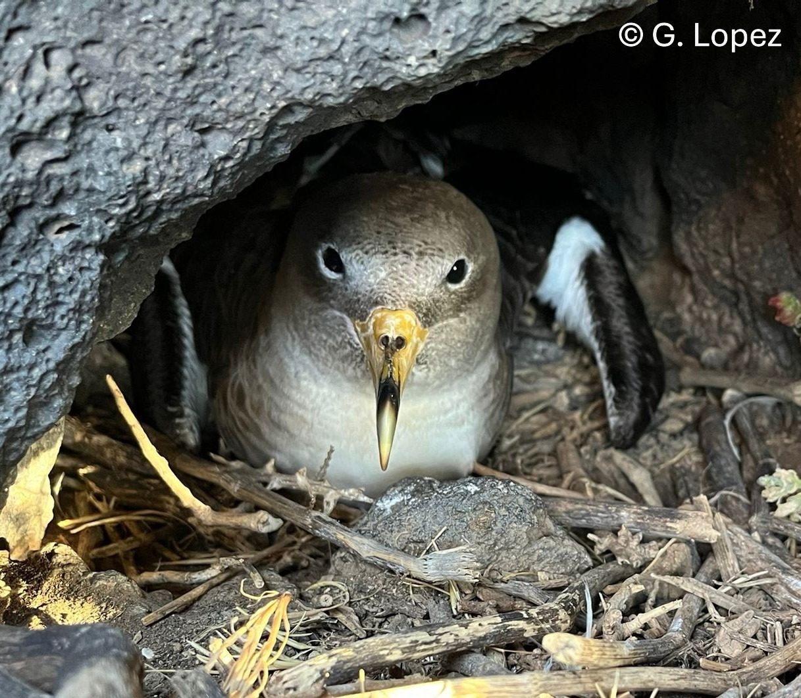

# Reproducible datasets and code for:

## Pollutant Exposure Shapes Mitochondrial Bioenergetics in a Wild Seabird *Calonectris diomedea*

### Guadalupe Lopez-Nava1\*, Lucie Michel2\*, Giacomo Dell’Omo3, Petra Quillfeldt2,  Paco Bustamante4, and Stefania Casagrande1

\* joint first-authors

1)  *Evolutionary Physiology Research Group, Max Planck Institute for Biological Intelligence, Eberhard-Gwinner-Str., 82319, Seewiesen, Germany*
2)  *Animal Ecology and Systematics, Justus-Liebig University, Giessen, Germany*
3)  *Ornis italica, Rome, Italy*
4)  *Littoral Environnement et Sociétés (LIENSs), UMR 7266 CNRS-Université de la Rochelle, 2 rue Olympe de Gouges, 17000 La Rochelle, France*

✉ For correspondence regarding the code, statistical analyses or the study system , please
contact: Guadalupe
(<a href= "mailto:lopez-nava.guadalupe@bi.mpg.de">lopez-nava.guadalupe[at]bi.mpg.de</a>)

✉ For correspondence regarding the data collection and study system please
contact: 
Stefania (mitochondrial metabolism)
(<a href= "mailto:stefania.casagrande@bi.mpg.de">stefania.casagrande[at]bi.mpg.de</a>) or
Lucie (contaminants and stable isotopes)
(<a href= "mailto:lucie.michel282@gmail.com">lucie.michel282[at]gmail.com</a>)

In this repository you can find all the data and code needed to
reproduce our study on contaminants and mitochondria 
bioenergetic metabolism in Scopoli's shearwater (*Calonectris diomedea*) sampled over 2 years in Linosa Island located in the Sicilian Channel (IT)

#### Repository Contents

- [`Rscript_PaperContaminantsMito_Shearwaters_20251001.R`](https://github.com/lguadal/ContaminantsMitoShearwaters/blob/main/Rscript_PaperContaminantsMito_Shearwaters_20251001.R)
    R script containing statistical analyses. All analyses are referenced according to their number in the manuscript
- [`ContaminantsMitoShearwater.Rproj`](https://github.com/lguadal/ContaminantsMitoShearwaters/blob/main/ContaminantsMitoShearwater.Rproj)
    RStudio project to run and reproduce results

[**`figures`**](https://github.com/lguadal/ContaminantsMitoShearwaters/tree/main/figures) all of which were created using the R package [ggplot2 v.3.3.3](https://cran.r-project.org/web/packages/ggplot2/index.html).

-   [`Fig1`](https://github.com/lguadal/ContaminantsMitoShearwaters/blob/main/figures/Fig1.png) 
-   [`Fig2`](https://github.com/lguadal/ContaminantsMitoShearwaters/blob/main/figures/Fig2.png) 
-   [`Fig3`](https://github.com/lguadal/ContaminantsMitoShearwaters/blob/main/figures/Fig3.png) 
-   [`Fig4`](https://github.com/lguadal/ContaminantsMitoShearwaters/blob/main/figures/Fig4.png) 
-   [`Fig5`](https://github.com/lguadal/ContaminantsMitoShearwaters/blob/main/figures/Fig5.png) 
-   [`Fig6`](https://github.com/lguadal/ContaminantsMitoShearwaters/blob/main/figures/Fig5.png)

[**`images`**](https://github.com/lguadal/ContaminantsMitoShearwaters/tree/main/images) folder containing the graphic in the Readme and figure 1c in the manuscript
-   [`shearwateradult.jpeg`](https://github.com/lguadal/ContaminantsMitoShearwaters/blob/main/images/shearwateradult.jpeg) 

[**`suppinfo`**](https://github.com/lguadal/ContaminantsMitoShearwaters/tree/main/suppinfo) folder including figures and tables of supplementary information: tables created using the R package [gt v.0.2.2](https://cran.r-project.org/web/packages/gt/index.html) and figures using  R package [ggplot2 v.3.3.3](https://cran.r-project.org/web/packages/ggplot2/index.html)..

-   [`FigS1.png`](https://github.com/lguadal/ContaminantsMitoShearwaters/blob/main/suppinfo/FigS1.png) 
-   [`FigS2.png`](https://github.com/lguadal/ContaminantsMitoShearwaters/blob/main/suppinfo/FigS2.png) 
-   [`FigS3.png`](https://github.com/lguadal/ContaminantsMitoShearwaters/blob/main/suppinfo/FigS3.png) 
-   [`TabS1.pdf`](https://github.com/lguadal/ContaminantsMitoShearwaters/blob/main/suppinfo/TabS1.pdf)
-   [`TabS2_PFDS.pdf`](https://github.com/lguadal/ContaminantsMitoShearwaters/blob/main/suppinfo/TabS2_PFDS.pdf) 
-   [`TabS2_PFDODA.pdf`](https://github.com/lguadal/ContaminantsMitoShearwaters/blob/main/suppinfo/TabS2_PDODA.pdf) 
-   [`TabS2_PFHPS.pdf`](https://github.com/lguadal/ContaminantsMitoShearwaters/blob/main/suppinfo/TabS2_PFHPS.pdf) 
-   [`TabS2_PFOA.pdf`](https://github.com/lguadal/ContaminantsMitoShearwaters/blob/main/suppinfo/TabS2_PFOA.pdf) 
-   [`TabS2_PFHXS.pdf`](https://github.com/lguadal/ContaminantsMitoShearwaters/blob/main/suppinfo/TabS2_PFHXS.pdf) 
-   [`TabS2_PFDA.pdf`](https://github.com/lguadal/ContaminantsMitoShearwaters/blob/main/suppinfo/TabS2_PFDA.pdf) 
-   [`TabS2_PFNA.pdf`](https://github.com/lguadal/ContaminantsMitoShearwaters/blob/main/suppinfo/TabS2_PFNA.pdf)
-   [`TabS2_PFOS.pdf`](https://github.com/lguadal/ContaminantsMitoShearwaters/blob/main/suppinfo/TabS2_PFOS.pdf) 

[**`tables`**](https://github.com/lguadal/ContaminantsMitoShearwaters/tree/main/tables) tables from Results section (referenced by table number in manuscript), all of which were created using the R package [gt v.0.2.2](https://cran.r-project.org/web/packages/gt/index.html).
*Note*: All tables (including those from the supplementary information) only show the frequentist results. For credible intervals resulting from models using Bayesian statistics refer to code section of each specified model in the R script.

[**`data`**](https://github.com/lguadal/ContaminantsMitoShearwaters/tree/main/data)

-   [`data_MitoCont_Shearwaters.csv`](https://github.com/lguadal/ContaminantsMitoShearwaters/blob/main/data/data_MitoCont_Shearwaters.csv)
-   [`data_MitoCont_Shearwaters.rds`](https://github.com/lguadal/ContaminantsMitoShearwaters/blob/main/data/data_MitoCont_Shearwaters.rds)

## Dataset description: 

This dataset contains physiological and contaminant measurements from Scopoli's shearwaters sampled in 2020–2021.  
Each row represents an individual bird and includes information on biological attributes (age, body mass, sex), mitochondrial function (bioenergetic assays), contaminant concentrations (PFAS and mercury), and stable isotope ratios (δ¹³C, δ¹⁵N).

---

### Column descriptions

| Column name | Type | Units / Scale | Description |
|--------------|------|---------------|--------------|
| `year` | factor | categorical (2020, 2021) | Sampling year. |
| `nest` | factor | categorical (31 levels) | Nest identifier corresponding to nest site. |
| `ring` | factor | categorical (48 levels) | Ring number identifying each individual bird. Real ring numbers have been replaced with anonymized (dummy) identifiers, but the "real" ring numbers can be provided upon request. |
| `sex` | factor | categorical (`Female`, `Male`) | Sex of the individual. |
| `age` | numeric | years | Estimated age of the individual. |
| `bodymass` | integer | g | Body mass at the time of sampling. |
| `DateMito` | factor | date (MM/DD/YYYY) | Date when mitochondrial measurements were performed. |
| `TimeMito` | factor | time (hh:mm:ss) | Time of day when mitochondrial assays were conducted. |
| `CMR` | numeric | pmol O₂ s⁻¹ mg⁻¹ | Cellular metabolic rate. |
| `OXPHOS` | numeric | pmol O₂ s⁻¹ mg⁻¹ | Oxidative phosphorylation. |
| `LEAK` | numeric | pmol O₂ s⁻¹ mg⁻¹ | Proton leak respiration rate (non-phosphorylating). |
| `ETS` | numeric | pmol O₂ s⁻¹ mg⁻¹ | Maximal electron transport system capacity. |
| `FCR1` | numeric | ratio | Coupling inefficiency index: proportion of LEAK to CMR respiration. |
| `PFOA` | numeric | ng/g | Perfluorooctanoic acid (PFOA) concentration. |
| `PFHPS` | numeric | ng/g | Perfluoroheptanesulfonic acid (PFHpS) concentration. |
| `PFNA` | numeric | ng/g | Perfluorononanoic acid (PFNA) concentration. |
| `P37DMOA` | numeric | ng/g | Perfluoro-3,7-dimethyloctanoic acid concentration. |
| `PFOS` | numeric | ng/g | Perfluorooctanosulfonic acid (PFOS) concentration. |
| `PFDA` | numeric | ng/g | Perfluorodecanoic acid (PFDA) concentration. |
| `PFUNA` | numeric | ng/g | Perfluoroundecanoic acid (PFUnA) concentration. |
| `PFDODA` | numeric | ng/g | Perfluorododecanoic acid (PFDoDA) concentration. |
| `FTS_10_2` | numeric | ng/g | 0:2 Fluorotelomer sulfonic acid concentration. |
| `PFTRIDA` | numeric | ng/g | Perfluorotridecanoic acid (PFTrDA) concentration. |
| `PFTDA` | numeric | ng/g | Perfluorotetradecanoic acid (PFTDA) concentration. |
| `PFHXS` | numeric | ng/g | Perfluorohexane sulfonic acid (PFHxS) concentration. |
| `PFDS` | numeric | ng/g | Perfluorodecane sulfonic acid (PFDS) concentration. |
| `PFOSA` | numeric | ng/g | Perfluorooctane sulfonamide (PFOSA) concentration. |
| `SUMPFAS` | numeric | ng/g | Sum of all measured PFAS concentrations for each individual. |
| `d13C` | numeric | ‰ (per mil, δ notation) | Stable carbon isotope ratio; indicates dietary carbon sources. |
| `X.C` | numeric | % | Percent carbon content of the tissue. |
| `d15N` | numeric | ‰ (per mil, δ notation) | Stable nitrogen isotope ratio; indicates trophic position. |
| `X.N` | numeric | % | Percent nitrogen content of the tissue. |
| `C_N` | numeric | ratio | Carbon-to-nitrogen ratio of the sample (proxy for lipid content). |
| `hg` | numeric | µg/g dry weight | Total mercury concentration in tissue. |
| `Notes` | factor | text | Additional comments. |
| `d15N.Z` | numeric | standardized (Z-score) | Standardized δ¹⁵N value (centered and scaled). |
| `d13C.Z` | numeric | standardized (Z-score) | Standardized δ¹³C value. |
| `age.Z` | numeric | standardized (Z-score) | Standardized age of the individual. |
| `bodymass.Z` | numeric | standardized (Z-score) | Standardized body mass. |
| `hg.Z` | numeric | standardized (Z-score) | Standardized mercury concentration. |
| `SUMPFAS.Z` | numeric | standardized (Z-score) | Standardized total PFAS concentration. |

---

### Notes

- **Units:** Concentrations for PFAS are expressed in ng/g, and mercury in µg/g.
- **Stable isotopes:** δ¹³C and δ¹⁵N values are expressed relative to international standards (VPDB for carbon; Air N₂ for nitrogen).  
- **Z-scores:** Variables ending in `.Z` are standardized (mean = 0, SD = 1) to facilitate multivariate analysis.  
- **Mitochondrial bioenergetic (CMR, OXPHOS, LEAK, ETS, FCR1)** All traits (except FCR1, which is a ratio) are
expressed in pmol O₂ s⁻¹ mg⁻¹ and derived from high-resolution respirometry measurements on red blood cells samples.

---

#### Usage Policy

You are welcome to view and download the materials in this repository.  
However:

- **Do not** use, modify, or share any code or data without **written permission** by Stefania Casagrande (<a href= "mailto:stefania.casagrande@bi.mpg.de">stefania.casagrande[at]bi.mpg.de</a>) 

© 2025 Guadalupe Lopez-Nava – All rights reserved.

